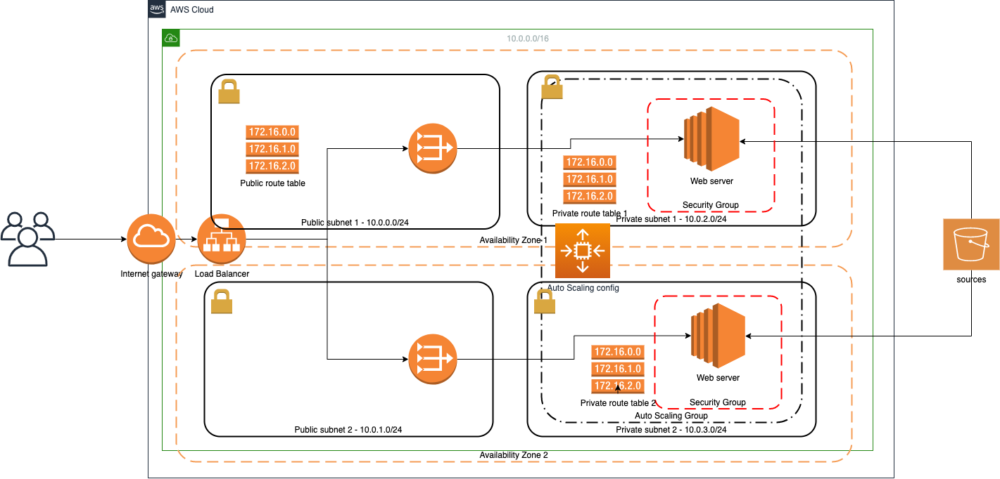

# udacity-devops-udagram
Repo with CloudFormation script for Udagram env setup

# Deploy

1) give execution permissions to create.sh script:
> chmod +x create.sh

2) Create network stack:

> ./create.sh udagram-network udagram-network.yml udagram-network-parameters.json

It will create all required network structure

3) Create servers in autoscaling group:

> ./create.sh udagram-servers udagram-servers.yml udagram-servers-parameters.json

Similarly, if need to update stacks, use update.sh script.